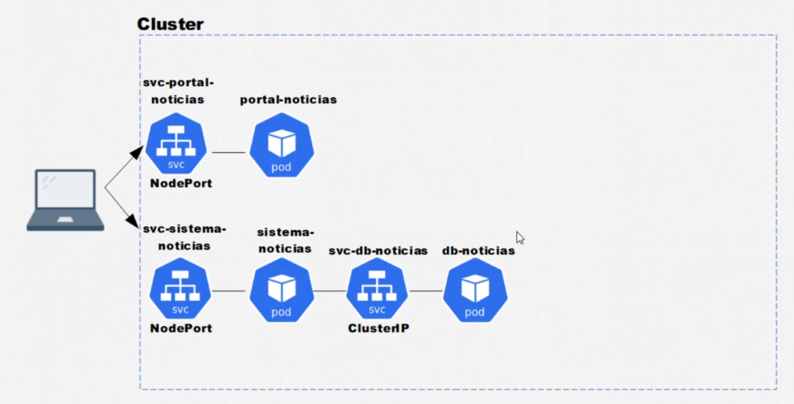

<p>
  
  
</p>

<h1 align="center">Alura cursos Projeto Portal de noticias </h1>

### Projeto Kubernetes demonstrado no curso da Alura

## 1 - Instalação Minikube.

    <p>Minikube é uma ferramenta que facilita o aprendizado e desenvolvimento com kubernetes de fácil instalação.  </p>

### Input

- `instance` - "t2-micro"
- `aws_region` - "us-east-2"
- `ssh-key` - "ssh_key_name"
- `instance_name` - "dev"

### Output

- `IP` - IP publico
- `DNS` - DNS publico

### Usage

```hcl
module "aws_dev" {
  source        = "../../infra"
  instance      = "t2.micro"
  aws_region    = "us-east-2"
  ssh-key       = "iac_alura_dev"
  instance_name = "dev"
}
module "aws_prod" {
  source        = "../../infra"
  instance      = "t2.medium"
  aws_region    = "us-east-2"
  ssh-key       = "ssh_key_name"
  instance_name = "prod"
}
```

## 2 - Criando maquina de desenvolvimento e produção.

```sh
cd env/dev ou cd env/prod
terraform init
terraform plan
terraform apply
ansible-playbook playbook.yml -i hosts.yml -u user --private-key ssh-key
```

O arquivo hosts.yml deve conter o ip publico do servidor

## Autor

👤 **Marcus Vinicius**

- Github: [marcusjava](https://github.com/marcusjava)
